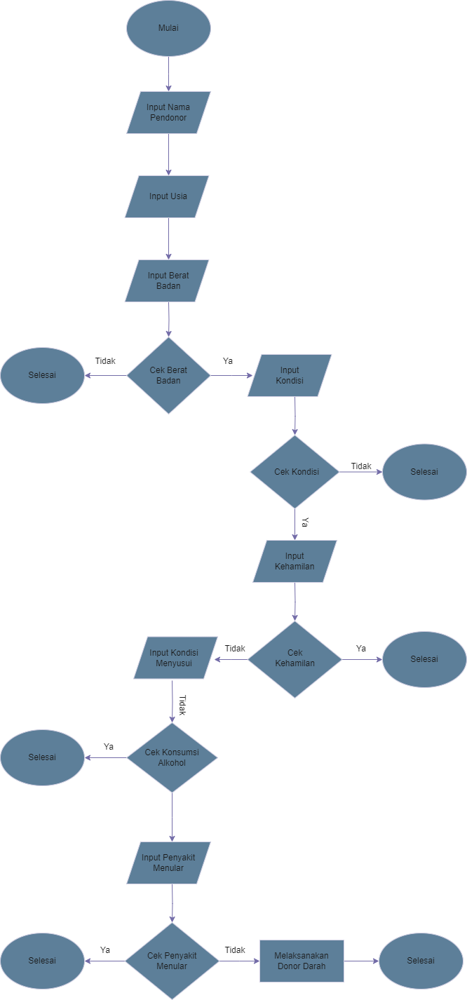

# PENDONOR DARAH

## Studi Kasus

 karena saya pernah menjadi panitia donor darah dalam komunitas FORPIS (Forum Pemuda Indonesia Sehat) se-Kabupaten Tegal, saya sebagai panitia terkadang kesulitan dalam mendata dan memilih mana yang boleh mendonor dan mana yang tidak, karena banyaknya pendonor dan kondisi kesehatan yang tentunya berbeda-beda.

## Proses Codingan

1. Inisialisasi Data

Inisialisasi: Program diawali dengan tampilan judul "PENDONOR DARAH"

2. Input Data Pendonor

Program meminta pendonor memasukkan data pendonor.

Data yang dimasukkan akan dievaluasi untuk menentukan status kelayakan pendonor (Apakah pendonor memenuhi semua syarat atau tidak).

3. Evaluasi Status

Program menggunakan kondisi if untuk mengevaluasi apakah pendonor memenuhi semua persyaratan yang ada'.

Jika pendonor memenuhi semua persyaratan maka status pendonor akan mencetak "Silahkan Mendonorkan Darah Anda"

Jika tidak memenuhi semua persyaratan maka status pendonor akan mencetak "Mohon Maaf, Anda Belum Memenuhi Syarat Untuk Menjadi Pendonor"

## Langkah-Langkah Program

Berikut adalah langkah-langkah rinci berdasarkan program yang diberikan:

1. Cetak Judul

    >print('PENDONOR DARAH')

2. Input & Evaluasi Data Pendonor

Minta Input Nama Pendonor, Usia, Berat Badan, Kondisi, Hamil, Menyusui, Konsumsi Alkhohol, Penyakit Menular.

    >nama_pendonor = str(input('Masukkan Nama :'))

    >usia = int(input('Masukkan Usia :'))
    
    >berat_badan = float(input('Masukkan Berat Badan Anda :'))

    >kondisi = str(input('Apakah kondisi Anda sehat? (ya/tidak) :'))

    >hamil = str(input('Apakah Anda dalam kondisi hamil? (ya/tidak) :'))

    >menyusui = str(input('Apakah Anda sedang dalam menyusui? (ya/tidak) :'))

    >konsumsi_alkohol = str(input('Apakah Anda konsumsi alkohol dalam 48 jam terakhir? (ya/tidak) :'))

    >penyakit_menular = str(input('Apakah Anda memiliki penyakit menular? (ya/tidak) :'))

3. Pesan Penutup

Setelah semua data pendonor sudah ter-input, tampilkan hasil kelayakan pendonor.

    >print('Silahkan Mendonorkan Darah Anda')

    print('Mohon Maaf, Anda Belum Memenuhi Syarat Untuk Menjadi Pendonor')

    print('Terimakasih')

